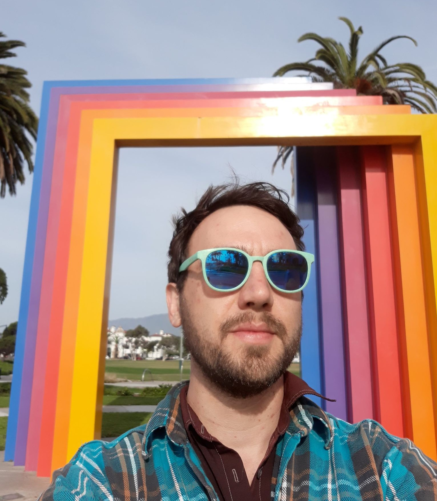

 
I'm Theo, a bioinformatician and data scientist. I develop open source research software and analytical data pipelines, maintain Bioconductor packages and perform omics data analyses in collaboration with many diverse research collaborators. My research interests include integrating multiomics datasets, data mining, computational biology, reproducible research, applied machine learning, the molecular biology of cancer and longevity, bionanotechnology and synthetic biology. I am committed to continuously learning new skills. I enjoy helping others discover the utility of R, Python and Bash. My hobbies include bike touring, climbing volcanoes, mushroom hunting and raising carnivorous plants.
 
 
 

