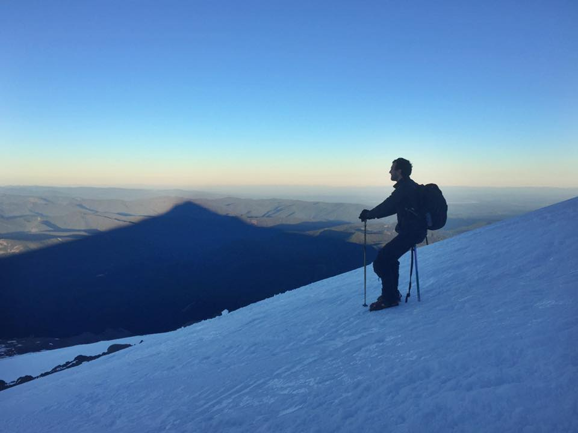

 
I am very passionate about bioinformatics, data science and biotechnology. I
interrogate a diverse array of biological data including: single cell and bulk
RNAseq, proteomic, metabolomic, ATACseq, CRISPR knockout screens, SNP calling
and flow cytometry omics data. I also develop open source research software,
including bioinformatic workflows, analytical pipelines and web applications. My
research interests are focused on understanding the molecular mechanisms of
cancer and longevity, integration of large scale multiomics data, reproducible
research, bionanotechnology and synthetic biology. My hobbies include bike
touring, climbing volcanoes and raising carnivorous plants.
 
 
 

