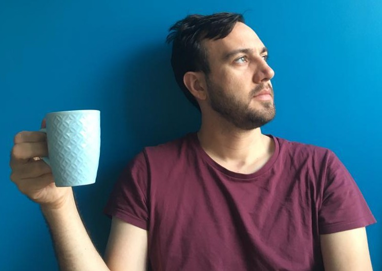

 
 
I am a bioinformatician and data scientist at the [De Duve Institute](http://www.deduveinstitute.be/),
working in the [Gatto Lab](http://www.deduveinstitute.be/computational-biology).
I develop open source research software and analytical pipelines, maintain
Bioconductor packages and perform RNAseq and proteomic data analyses in 
collaboration with other research groups.
 
 
My research interests aside from bioinformatics and data science include
computational biology, proteomics, protein structure prediction, structural
biology, reproducible research, applied machine learning, bionanotechnology and 
synthetic biology.
 
 
For me, the two most interesting things in the world are exploring the richness
of the chemistry of life and the science of understanding our world as
information. I have built a career out of combining these twin interests. I
firmly believe in the power of these areas of research to deliver unique
solutions, improve human lives and to provide insight to navigate many of
the complex problems facing our species in the 21st century.
 
 

